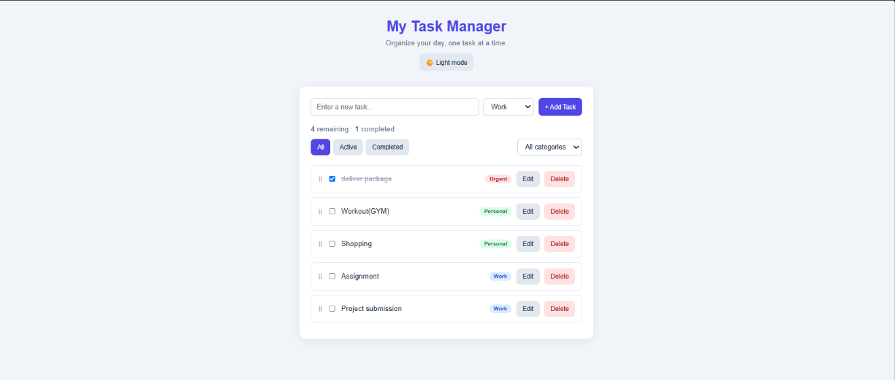
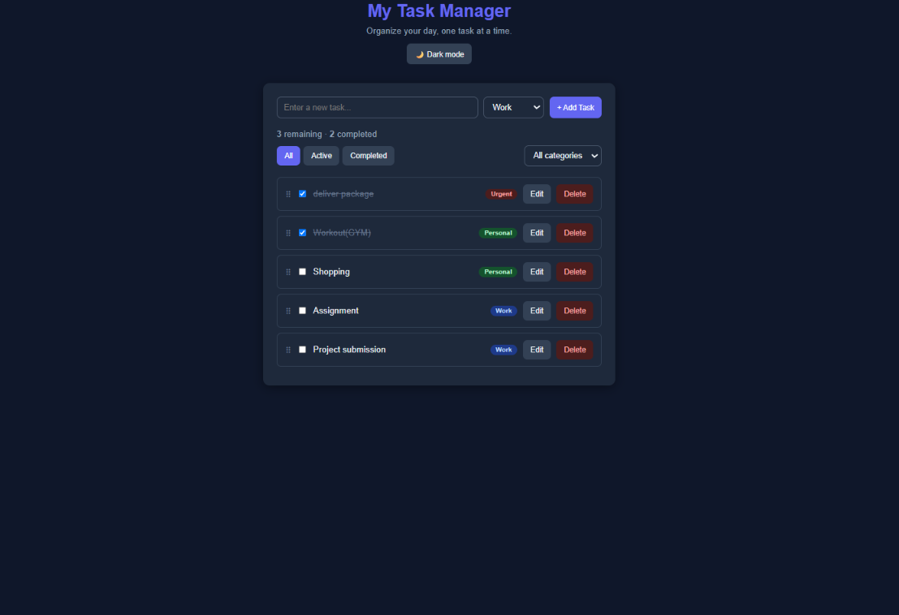
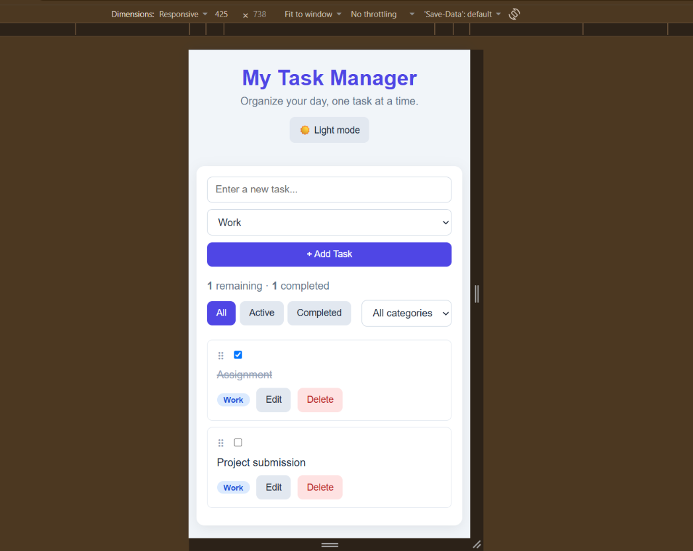

# My Task Manager

This is my React course project, a task manager where I can add my daily tasks, put them in categories, and tick them off when they're done. Everything is saved in the browser, so the tasks are still there after I refresh the page.

Live demo: https://your-link.vercel.app

## What it can do

- Add, edit, delete and complete tasks
- Put each task in a category (Work, Personal or Urgent), shown with a coloured label
- Filter tasks by All, Active or Completed, and also by category
- Shows how many tasks are remaining and how many are completed
- Saves tasks with localStorage
- Drag and drop to change the order of tasks (stretch goal)
- Dark and light mode button, and it remembers my choice (stretch goal)
- Works on both desktop and mobile screens

## Built with

- React (functional components and hooks)
- Vite
- Plain CSS
- localStorage

## How to run it

1. Clone the repo
```bash
   git clone https://github.com/sohan98416-max/personal-task-manager.git
```
2. Go into the folder
```bash
   cd personal-task-manager
```
3. Install the packages
```bash
   npm install
```
4. Start the app
```bash
   npm run dev
```
5. Open the link that shows in the terminal (usually http://localhost:5173)

## How the project is organized

- `src/components` has the 5 components: Header, TaskForm, FilterBar, TaskList and TaskItem
- `src/hooks/useLocalStorage.js` is a custom hook I made to save data in localStorage
- `src/constants.js` has the list of categories and filters
- `src/App.jsx` keeps the main state (tasks and theme) and the functions that change them

## Screenshots

Light mode



Dark mode



Mobile view



## What I learned

- How to split an app into smaller components and pass data and functions down with props
- Using `useState` for things like the task list and filters
- Using `useEffect` to save tasks and the theme whenever they change
- Making my own custom hook (`useLocalStorage`)
- Rendering lists with `.map()` and a unique `key`
- Using CSS variables to make the dark mode

## Things that don't work yet

- Drag and drop works with a mouse on desktop, but not by touch on phones. The page just scrolls.
- I did not add due dates or overdue warnings.
- The categories are fixed, so users can't make their own.